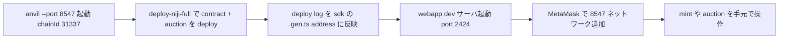

# ローカル開発フロー

webapp から contract を直接触りたい場合の最短セットアップ。 sepolia や mainnet を直接使うよりもガス代もデバッグも楽になります。

## 全体像



トークンの mint と tokenURI 表示だけ確認したいなら `deploy-niji-smoke`、 webapp で auction まで触りたいなら `deploy-niji-full` (または `pnpm task:run-local`) を使います。 smoke は auction house を deploy しないため、 webapp の boot path で auction address を読みに行く処理が失敗します。

## 1. anvil を立ち上げる

```sh
anvil --port 8547
```

本 repo は `packages/niji-contracts/hardhat.config.ts` の `localhost.url` と `packages/niji-webapp/src/constants/anvil.ts` の `ANVIL_PORT` が共に **8547** に固定されています。 anvil を default の 8545 で立ち上げると `pnpm hardhat deploy-niji-smoke --network localhost` も webapp 側も RPC に届かないので、 必ず `--port 8547` を指定してください。 chainId は 31337。 deterministic accounts (anvil 標準の 10 個) が用意され、 deployer は account[0]、 private key は anvil の起動 log に出る最初のキー (`0xac0974be...`) を使います。

## 2. contract をデプロイ

webapp との繋ぎ込みまで含めて触るなら `deploy-niji-full` を使ってください。 `deploy-niji-smoke` は auction house を deploy しないため webapp の boot path で auction address read が失敗します。

```sh
cd packages/niji-contracts
# token + descriptor + auction まで full deploy (webapp 連携用)
pnpm hardhat deploy-niji-full --network localhost
# あるいは contract task の wrapper
pnpm task:run-local
```

token / descriptor だけ動作確認したい (auction なしで OK) 場合は smoke で十分です。

```sh
pnpm hardhat deploy-niji-smoke --network localhost
```

`deploy-niji-smoke` は最低限 (NijiArt → NijiDescriptor → NijiSeeder → NijiToken) を入れて mint 1 体 + tokenURI 検証まで通します。 完走すると `packages/niji-contracts/deploy/localhost-{timestamp}-smoke.json` に contract address と gas 情報が書き出されます。

## 3. SDK に address を反映

deploy log を見ながら `packages/niji-sdk` 配下の生成 file (`src/react/*.gen.ts` と `src/actions/*.gen.ts`) を更新します。 主要 contract ごとに 1 ファイル単位で chainId 31337 の address 定数が定義されているので、 `auction-house.gen.ts` / `descriptor.gen.ts` / `seeder.gen.ts` / `token.gen.ts` 等を deploy 出力に合わせて書き換えます (この 4 file は wagmi cli の生成物なので、 wagmi cli を回せば自動更新も可能)。

webapp は sdk 経由で contract address を参照するため、 ここを更新しない限り画面は古い address を見続けます。

## 4. webapp 起動 + MetaMask 接続

```sh
cd packages/niji-webapp
cp .env.example.local .env
pnpm dev
```

webapp は `http://localhost:2424` で立ち上がります (strictPort: true で 3000 へのフォールバックはありません)。 MetaMask に「Hardhat」 ネットワーク (RPC `http://127.0.0.1:8547` / chainId 31337) を追加し、 anvil deployer の private key (`0xac0974bec39a17e36ba4a6b4d238ff944bacb478cbed5efcae784d7bf4f2ff80`) を import すれば最初の mint まで触れます。

## 5. 開発中によくやる操作

| やりたいこと | コマンド |
|---|---|
| contract の test | `cd packages/niji-contracts && pnpm hardhat test` |
| 特定 test だけ | `pnpm hardhat test test/niji/NijiToken.test.ts` |
| Foundry test | `cd packages/niji-contracts && forge test` |
| anvil リセット | `pkill anvil && anvil` |
| deploy log の最新 | `ls -t packages/niji-contracts/deploy/localhost-*.json | head -1` |
| webapp の lint | `cd packages/niji-webapp && pnpm -w lint src/` |
| webapp の型 check | `cd packages/niji-webapp && pnpm tsc --noEmit` |
| graphql 型再生成 | `cd packages/niji-webapp && pnpm graphql-codegen` |
| i18n 再抽出 | `cd packages/niji-webapp && pnpm i18n:extract && pnpm i18n:compile` |

## つまずきやすいポイント

### deploy-niji-smoke の [10] tokenURI で revert

anvil の eth_call default gas limit が 30M で、 12 layer の SVG 生成が走り切らずに revert することがあります。 PR #249 以降は deploy script 側で gasLimit 300M override をかけているので最新 master であれば問題ありません。

### MetaMask が「Internal JSON-RPC error」 を返す

anvil を再起動した場合は MetaMask 側で nonce がズレています。 設定 → 詳細 → アカウントをリセット で解消します。 deployer 以外の account を使うのも有効です。

### 「Token does not exist」 が画面に出る

webapp が古い token id を覚えている可能性があります。 MetaMask の active account が deployer なら 1 度 mint して tokenId 0 を生成、 1 体目はその後の auction で settle 済になります。

### `pnpm test:watch` が CI のように 1 度で終わってしまう

vitest の `CI=true` が設定されているかもしれません。 `unset CI && pnpm test:watch` で watch mode に戻ります。

## 次のステップ

- contract に新しい admin 関数を追加したい場合は [packages/niji-contracts/contracts/NijiToken.sol](../packages/niji-contracts/contracts/NijiToken.sol) を真似て error / event / 関数 + テストを追加してください。 既存の Pausable / Withdraw / Reveal / baseURI fallback のパターンが参考になります。
- webapp に新しいページを追加したい場合は [src/pages/](../packages/niji-webapp/src/pages/) に置き、 [src/index.tsx](../packages/niji-webapp/src/index.tsx) の routing に追加します。 styling は Tailwind + shadcn/ui を default にしてください。
