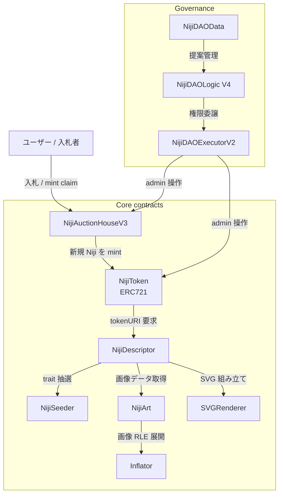

# Architecture

Niji DAO の on-chain アーキテクチャを構成要素ごとに整理する。
各 contract は単一責務で組み合わせて稼働する。
コードは [`packages/niji-contracts/contracts/`](https://github.com/Niji-DAO/niji-monorepo/tree/develop/packages/niji-contracts/contracts) を参照。

## 全体像

Niji の core 構成は 5 系統 (Token / AuctionHouse / Descriptor / Seeder / Art) に分かれ、 ユーザー / DAO governance / 入札者の 3 アクターと相互作用する。



## Core 5 系統の責務

### NijiToken

ERC721 実装で個別 Niji NFT の所有権を管理する。
[`packages/niji-contracts/contracts/NijiToken.sol`](https://github.com/Niji-DAO/niji-monorepo/blob/develop/packages/niji-contracts/contracts/NijiToken.sol) が SSOT。

```solidity
contract NijiToken is INijiToken, Ownable, ERC721Checkpointable {
    function mint() public onlyMinter returns (uint256) {
        // ...
        return _mintTo(minter, _currentNijiId++);
    }
}
```

`mint()` は AuctionHouse からのみ呼ばれ、 新しい token id を発行して seed を Seeder で抽選する。 `tokenURI(tokenId)` を呼ばれると Descriptor 経由で SVG を build して data URI を返す。

### NijiAuctionHouseV3

Niji の英国式オークション (English auction、 上昇式) を実装する。
[`packages/niji-contracts/contracts/NijiAuctionHouseV3.sol`](https://github.com/Niji-DAO/niji-monorepo/blob/develop/packages/niji-contracts/contracts/NijiAuctionHouseV3.sol) が SSOT。

1 日 1 体ペースで auction が開かれる仕組みで、 終了時刻直前の入札があれば自動延長 (`timeBuffer`) する。 落札後の wei は DAO Treasury (`NijiDAOExecutorV2`) に送金される。

### NijiDescriptor

`tokenURI()` の中身を生成する責務を持つ。
[`packages/niji-contracts/contracts/NijiDescriptor.sol`](https://github.com/Niji-DAO/niji-monorepo/blob/develop/packages/niji-contracts/contracts/NijiDescriptor.sol) が SSOT。

trait 抽選結果から Art に保存された圧縮画像を取得し、 Inflator で RLE 展開、 SVGRenderer で SVG 文字列を組み立てる。 全工程が完全 on-chain で external storage に依存しない。

### NijiSeeder

5 trait (background / body / accessory / head / glasses) のランダム抽選を実装する。
[`packages/niji-contracts/contracts/NijiSeeder.sol`](https://github.com/Niji-DAO/niji-monorepo/blob/develop/packages/niji-contracts/contracts/NijiSeeder.sol) が SSOT。

block 情報 + token id + chainid + 回転 salt から seed を生成し、 trait ごとの個数で剰余を取って index を決定する (詳細は [Issue #34](https://github.com/Niji-DAO/niji-monorepo/issues/34) で確定した規約)。

### NijiArt

trait 別の圧縮画像データを on-chain に保管する。
[`packages/niji-contracts/contracts/NijiArt.sol`](https://github.com/Niji-DAO/niji-monorepo/blob/develop/packages/niji-contracts/contracts/NijiArt.sol) が SSOT。

palette + body parts + accessory parts + head parts + glasses parts を SSTORE2 経由で書き込み、 trait index 別に参照する。 mintBatch に 50 件上限 ([Issue #32](https://github.com/Niji-DAO/niji-monorepo/issues/32)) が掛かっており 1 tx あたりのガス消費を予測可能に抑えている。

## Governance 系統

### NijiDAOLogic V4

提案 / 投票 / queue / execute の governance 全体を司る。 提案を作るには `proposalThreshold` 以上の voting power が必要、 投票期間は `votingDelay` + `votingPeriod` で制御される。

### NijiDAOExecutorV2

DAO 提案が可決された後に実 action を実行する Timelock コントロール。 全 admin 操作 (mint 設定変更 / descriptor 差し替え / treasury 出金等) はこの Executor 経由で行われる仕様。

### NijiDAOData

提案候補 (Proposal Candidate) / signature / feedback の保管を担当する。 governance の周辺機能 (投票前のフィードバック収集、 candidate からの formalize) を切り出したもの。

## 補助系統

| 系統 | 役割 |
|---|---|
| StreamFactory + Stream | 給与 / vesting の継続支払いを on-chain で管理 |
| Payer + TokenBuyer | USDC / DAI / wei の換金を Treasury 経由で実行 |
| Rewards | proposal author / voter / referrer への ETH reward を分配 |
| ForkEscrow + ForkDAODeployer | DAO Fork (分岐) 機能を実装 |

各補助 contract のアドレスは [Deployments](/protocol/deployments) を参照。

## 完全 on-chain の意義

Niji は 画像 / metadata / governance / treasury の全てを on-chain に置く設計を採用する。
IPFS / off-chain server に依存しないため、 token 保有者は contract が存在する限り永続的に画像を取得できる。
SVG レンダリングのガス消費は `SVGRenderer` の最適化で 数百万 gas 程度に収まる ([NijiGas test](https://github.com/Niji-DAO/niji-monorepo/blob/develop/packages/niji-contracts/test/niji/NijiGas.test.ts) でベンチマーク済)。

## 関連

- [Deployments](/protocol/deployments) ... mainnet / sepolia の実 contract address 一覧
- [Forks](/protocol/forks) ... DAO Fork 機能の解説
- [Governance Parameters](/governance/proposals) ... 提案 / 投票パラメータの SSOT
