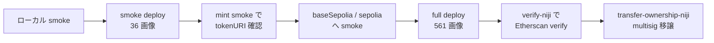

# Deploy Guide

Niji contracts をローカル / testnet / mainnet にデプロイする手順をまとめる。
SSOT は [`packages/niji-contracts/tasks/`](https://github.com/Niji-DAO/niji-monorepo/tree/develop/packages/niji-contracts/tasks) の hardhat task 実装。

## 前提

| 項目 | 値 |
|---|---|
| node | 16.x 以上 (monorepo は 18 / 20 推奨) |
| pnpm | 10.10.0 以上 |
| ツール | `pnpm install` で hardhat / foundry / ethers v6 が揃う |
| RPC | mainnet / sepolia / baseSepolia 用の `.env` (`packages/niji-contracts/.env`) |
| 鍵 | deployer の private key (`DEPLOYER_PRIVATE_KEY`) と etherscan API key (`ETHERSCAN_API_KEY`) |

`.env` は [`packages/niji-contracts/.env.example`](https://github.com/Niji-DAO/niji-monorepo/blob/develop/packages/niji-contracts/.env.example) を写してから埋める。

## 全体フロー



## Step 1. ローカル smoke deploy

最も軽量な確認経路。 NijiArt / NijiDescriptor / NijiSeeder / NijiToken を hardhat localhost に deploy し、 36 画像 (trait 別 3 個ずつ) を seed して 1 体 mint する。

```bash
cd packages/niji-contracts
pnpm install
pnpm exec hardhat deploy-niji-smoke --network hardhat
```

出力は `deploy/hardhat-{timestamp}-smoke.json` に書かれる。
contract address / gas used / 画像 hash が記録され reproducible。
tokenURI を返す JSON に SVG が embed されていれば smoke は成功扱い。

## Step 2. baseSepolia への smoke deploy

testnet で同じ smoke を実行して入金 / ガス見積もりを確認する。

```bash
pnpm exec hardhat deploy-niji-base-sepolia --network baseSepolia
```

baseSepolia の RPC + chain id は `hardhat.config.ts` で `cancun` hardfork pin 済 (EIP-7825 の 16M tx gas cap を回避)。
deploy 後に `block_gas_limit` 300M を活用した大規模 SSTORE2 書き込みも問題なく通る。

## Step 3. full deploy (561 画像)

本番想定の full deploy で全 561 画像を 12 trait category に分けて on-chain に書き込む。

```bash
pnpm exec hardhat deploy-niji-full --network sepolia
```

mintBatch は 50 件上限で実行される ([Issue #32](https://github.com/Niji-DAO/niji-monorepo/issues/32))。
ガス消費は trait あたり 数百万 gas 程度、 全体で約 5-15 ETH 相当 (mainnet 想定)。

## Step 4. snapshot 出力

deploy 結果は固定 path に snapshot される ([Issue #40](https://github.com/Niji-DAO/niji-monorepo/issues/40))。

```bash
pnpm exec hardhat snapshot-niji --network sepolia
```

出力は `deployments/{network}.json` に書かれ、 全 contract address + abi hash + block number が永続化される。

## Step 5. Etherscan verify

snapshot から一括 verify を実行する ([Issue #39](https://github.com/Niji-DAO/niji-monorepo/issues/39))。

```bash
pnpm exec hardhat verify-niji --network sepolia
```

`deployments/{network}.json` を読んで全 contract を順次 `npx hardhat verify` する。
失敗した contract は標準エラーに出力され、 reproducible に retry 可能。

## Step 6. multisig へ ownership 移譲

deployer EOA から multisig wallet (例 Safe) に owner 移譲する ([Issue #41](https://github.com/Niji-DAO/niji-monorepo/issues/41))。

```bash
pnpm exec hardhat transfer-ownership-niji --network sepolia --to <safe-address>
```

NijiToken / NijiAuctionHouseV3 / NijiDescriptor の 3 contract が順次 `transferOwnership(safe)` を呼ぶ。
Safe 側で `acceptOwnership` を承認すれば 2-step 移譲 (`Ownable2Step` 経路) が完了する。

## チェックリスト

- [ ] `.env` に `DEPLOYER_PRIVATE_KEY` + `ETHERSCAN_API_KEY` を設定済
- [ ] `hardhat deploy-niji-smoke --network hardhat` で local smoke が pass
- [ ] testnet (baseSepolia / sepolia) で smoke deploy が pass
- [ ] full deploy で 561 画像が on-chain に書き込まれた (`deployments/{network}.json` 出力済)
- [ ] `verify-niji` で全 contract が Etherscan verify 済
- [ ] `transfer-ownership-niji` で multisig に owner 移譲済
- [ ] [Deployments](/protocol/deployments) ページに address を反映

## 関連

- [Architecture](/protocol/architecture) ... contract 間の責務と相互作用
- [Deployments](/protocol/deployments) ... 確定済 mainnet / sepolia address
- [`tasks/deploy-niji-smoke.ts`](https://github.com/Niji-DAO/niji-monorepo/blob/develop/packages/niji-contracts/tasks/deploy-niji-smoke.ts)
- [`tasks/deploy-niji-full.ts`](https://github.com/Niji-DAO/niji-monorepo/blob/develop/packages/niji-contracts/tasks/deploy-niji-full.ts)
